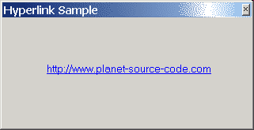

<div align="center">

## Hyperlink Sample \(one API function used:\-\)


</div>

### Description

This is in response to a yesterday's submission. No timer. No Set/Release capture (almost). The trick is that windowless controls ARE capturing mouse events upon mousedown BY DESIGN. So every label, image, or custom windowless control has the capture ability build-in. Thank you VB, I just figured out how to use this. Purely as an excercise you can encapsulate this code in a windowless usercontrol. Anyway, this implementation has at least two flaws. Can you find them? :-)) UPDATED: By popular demand now supports right click context menu, OLE drag&drop (good enough), "hand" mouse cursor (with shadow on win2k!), WM_CANCELMODE (pretty decently). More API's used but still under 160 lines of code. 10x for the votes
 
### More Info
 


<span>             |<span>
---                |---
**Submitted On**   |2002-02-12 17:31:52
**By**             |[Vlad Vissoultchev](https://github.com/Planet-Source-Code/PSCIndex/blob/master/ByAuthor/vlad-vissoultchev.md)
**Level**          |Intermediate
**User Rating**    |4.9 (584 globes from 120 users)
**Compatibility**  |VB 6\.0
**Category**       |[Windows System Services](https://github.com/Planet-Source-Code/PSCIndex/blob/master/ByCategory/windows-system-services__1-35.md)
**World**          |[Visual Basic](https://github.com/Planet-Source-Code/PSCIndex/blob/master/ByWorld/visual-basic.md)
**Archive File**   |[Hyperlink\_548112122002\.zip](https://github.com/Planet-Source-Code/vlad-vissoultchev-hyperlink-sample-one-api-function-used__1-31572/archive/master.zip)

### API Declarations

```
Private Declare Sub mouse_event Lib "user32"( _
  ByVal dwFlags As Long, ByVal dx As Long, _
  ByVal dy As Long, ByVal cButtons As Long, _
  ByVal dwExtraInfo As Long)
```


